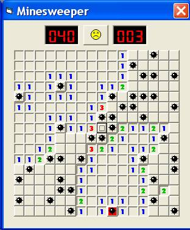

## VB Minesweeper

### Description

This is a VB version of Windows Minesweeper that I made. Unlike the real version, you can set the board as big as you want.
 
### More Info
 
It works just like regular minesweeper. Right click to mark a flag.

Don't try to make the board too big if your computer can't handle it, becuase it might freeze up. Large boards are more smooth when you compile the code before running it.

             |
---                |---
**Submitted On**   |2005-04-22 17:52:42
**By**             |[Martin O\.](https://github.com/Planet-Source-Code/PSCIndex/blob/master/ByAuthor/martin-o.md)
**Level**          |Intermediate
**User Rating**    |5.0 (10 globes from 2 users)
**Compatibility**  |VB 6\.0
**Category**       |[Games](https://github.com/Planet-Source-Code/PSCIndex/blob/master/ByCategory/games__1-38.md)
**World**          |[Visual Basic](https://github.com/Planet-Source-Code/PSCIndex/blob/master/ByWorld/visual-basic.md)
**Archive File**   |[VB\_Mineswe189858672005\.zip](https://github.com/Planet-Source-Code/martin-o-vb-minesweeper__1-60988/archive/master.zip)

